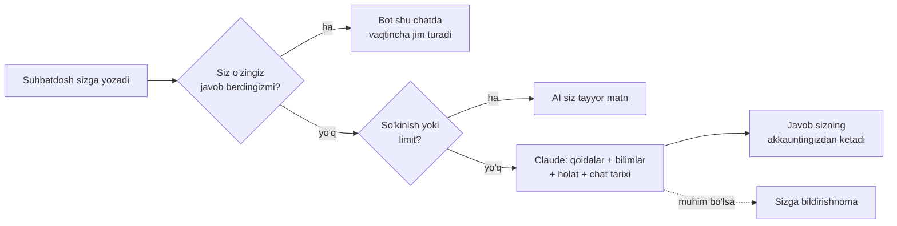

# Telegram AI javobchi

Siz band yoki offline bo'lganingizda shaxsiy Telegram chatlaringizga **sizning akkauntingizdan** javob beradigan AI yordamchi. Telegram'ning [Chat Automation](https://telegram.org/blog/telegram-business) (Business) imkoniyati va Anthropic Claude ustiga qurilgan.

> *A self-hosted Telegram bot that answers your private chats on your behalf with Claude while you are away. Documentation is in Uzbek.*


## Nima qila oladi

- **Sizning nomingizdan javob beradi.** Suhbatdosh sizga yozadi, javob sizning akkauntingizdan keladi. Qoidalar va bilimlarni botning o'z chatida o'rgatasiz.
- **Hozirgi holatingizni biladi.** `/bus`, `/sleep`, `/meeting` kabi bitta buyruq bilan qayerdaligingizni aytasiz, bot suhbatdoshlarga shuni yetkazadi.
- **Siz yozsangiz, chetga chiqadi.** Chatda o'zingiz javob bersangiz, bot o'sha chatda vaqtincha jim turadi.
- **Keraksiz joyda javob bermaydi.** "ok", "rahmat", stiker kabi xabarlarni o'tkazib yuboradi; ketma-ket kelgan xabarlarga bitta javob yozadi.
- **Muhim xabarni sizga yetkazadi.** Shoshilinch yoki shaxsan aralashuvingiz kerak bo'lgan xabar haqida botda bildirishnoma yuboradi.
- **Suiiste'moldan himoyalangan.** So'kingan suhbatdoshni ogohlantiradi va takrorlansa javob berishni to'xtatadi; bitta chatga AI javoblar soni cheklangan.
- **Faqat sizniki.** Bot bitta egaga xizmat qiladi; boshqa akkauntlar ulansa, e'tiborsiz qoldiriladi.

## Qanday ishlaydi



Batafsil: [docs/how-it-works.md](docs/how-it-works.md).

## Tez boshlash

Kerak bo'ladi: Python 3.10+, **Telegram Premium** (Chat Automation Telegram Business tarkibida), [BotFather](https://t.me/BotFather)'dan bot tokeni va [Anthropic API kaliti](https://console.anthropic.com).

```bash
git clone https://github.com/futzone/tg-automation-bot.git
cd tg-automation-bot
python3 -m venv .venv && source .venv/bin/activate
pip install -r requirements.txt
cp .env.example .env        # BOT_TOKEN, OWNER_ID, OWNER_NAME, ANTHROPIC_API_KEY ni to'ldiring
python bot.py
```

Keyin Telegram'da:

1. BotFather → `/mybots` → botingiz → **Bot Settings → Business Mode → Turn on**
2. Botingizga `/start` yuboring (bildirishnomalar kelishi uchun shart)
3. **Settings → Business → Chat Automation** → bot username'ini kiriting → **Reply to messages** ruxsatini yoqing

Har bir qadami bilan to'liq qo'llanma: [docs/setup.md](docs/setup.md).

## Boshqaruv

Hammasi botning o'z chatida, oddiy buyruqlar bilan:

| Buyruq | Vazifasi |
|---|---|
| `/add <matn>` yoki oddiy matn | Qoida qo'shish |
| `/persona <matn>` | O'zingiz haqingizda tavsif |
| `.txt` / `.md` fayl yuborish | Bilim bazasiga qo'shish (FAQ, narxlar...) |
| `/bus`, `/sleep`, `/work`... | Hozirgi holatingiz; `/bus 40` — 40 daqiqaga |
| `/free` | Holatni o'chirish |
| `/test <xabar>` | Javobni hech kimga yubormasdan sinash |
| `/pause`, `/resume` | Botni to'xtatish / yoqish |
| `/status` | Joriy holat |

Barcha buyruqlar: [docs/commands.md](docs/commands.md).

## Hujjatlar

| Hujjat | Mazmuni |
|---|---|
| [O'rnatish](docs/setup.md) | BotFather, Chat Automation, `.env`, birinchi ishga tushirish |
| [Buyruqlar](docs/commands.md) | Qoidalar, bilim bazasi, holatlar, boshqaruv |
| [Sozlamalar](docs/configuration.md) | `.env` o'zgaruvchilari, so'kinish filtri, model tanlash, xarajat |
| [Serverga joylash](docs/deployment.md) | systemd bilan 24/7 ishlatish, yangilash, zaxira nusxa |
| [Qanday ishlaydi](docs/how-it-works.md) | Arxitektura, xabar yo'li, prompt, ma'lumotlar bazasi |
| [Muammolar](docs/troubleshooting.md) | "Bot javob bermayapti" va boshqa tez-tez uchraydigan holatlar |

## Maxfiylik va xavfsizlik

- Bot o'zingizning serveringizda ishlaydi. Chat tarixi faqat lokal SQLite faylida (`data/bot.db`) saqlanadi.
- Javob yozish uchun har bir chatning oxirgi xabarlari Anthropic API'ga yuboriladi. Buni istamagan chatlaringizni Chat Automation sozlamalarida **Excluded chats** ga qo'shing.
- Bot AI ekanini yashirmaydi: suhbatdosh to'g'ridan-to'g'ri so'rasa, yordamchi ekanini aytadi.
- `.env` va `data/` `.gitignore` da. Token va kalitlarni hech qachon commit qilmang.

## Tuzilma

```
bot.py              kirish nuqtasi
app/config.py       .env sozlamalari
app/db.py           SQLite: qoidalar, bilimlar, tarix, pauzalar, limitlar
app/llm.py          Claude API
app/prompt.py       system prompt, [SKIP] / [NOTIFY] tahlili
app/business.py     shaxsiy chatlarga javob berish, limit va so'kinish cheklovi
app/status.py       holat shablonlari (/bus, /sleep...)
app/moderation.py   so'kinish filtri
app/owner.py        boshqaruv paneli
badwords.txt        so'kinish filtri ro'yxati
aibot.service       systemd service namunasi
```

## Litsenziya

[MIT](LICENSE) — erkin foydalaning, o'zgartiring va tarqating.
